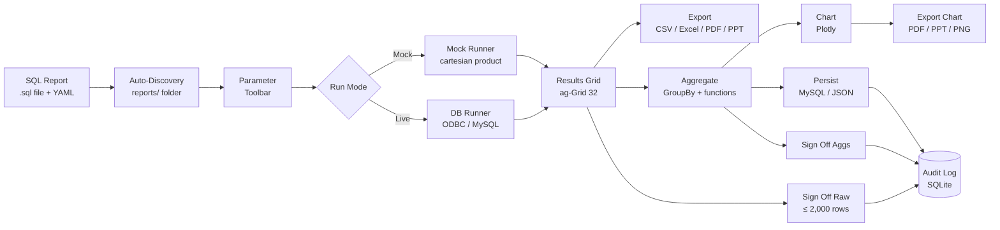

# RJK Reporting Framework

A self-contained SQL reporting platform. Authors write SQL files with embedded YAML metadata; the framework discovers them automatically, renders a parameter toolbar, runs the query (or generates mock data), and displays results in an interactive grid.

---

## Workflow



---

## Tech Stack

| Layer | Library | Version |
|---|---|---|
| **API server** | FastAPI | ≥ 0.109 |
| **ASGI server** | Uvicorn | ≥ 0.27 |
| **Results grid** | ag-Grid 32 | community |
| **UI framework** | Bootstrap | 5.3.3 |
| **Charts** | Plotly.js (client) + Plotly Python (server) | ≥ 5 / 6 |
| **Chart image export** | kaleido | ≥ 0.2 |
| **PDF export** | reportlab | ≥ 4.0 |
| **PowerPoint export** | python-pptx | ≥ 0.6 |
| **Excel export** | openpyxl | ≥ 3.1 |
| **Data aggregation** | pandas | ≥ 2.0 |
| **MySQL persistence** | SQLAlchemy + PyMySQL | ≥ 2.0 / 1.1 |
| **Audit log** | SQLite (via stdlib) | — |
| **Metadata parsing** | PyYAML | ≥ 6.0 |
| **Config** | python-dotenv | ≥ 1.0 |
| **Tests** | pytest + pytest-asyncio + httpx | — |

---

## Features

### Report Discovery & Execution
- SQL files under `reports/` are auto-discovered and shown in a collapsible folder tree
- YAML metadata block inside each `.sql` file defines title, description, owner, tags, and parameters
- Parameters render as a toolbar (date pickers, dropdowns, text inputs)
- `MOCK_MODE=true` generates synthetic cartesian-product data from the metadata — no database required
- `MOCK_MODE=false` runs the SQL against a real database via pyodbc or the configured MySQL URL

### Grid & Export
- Results displayed in ag-Grid with column resizing, sorting, and a saveable column chooser
- Export to **CSV**, **Excel**, **PDF** (landscape A4), or **PowerPoint** directly from the toolbar
- Client-side exports available immediately; server-side PDF/PPT export for full fidelity

### Data Aggregation
- Aggregate tab: group-by columns + numeric aggregation functions (sum, mean, count, min, max)
- Control-total check: compares raw vs aggregated sums and highlights discrepancies
- Aggregation results can be persisted to MySQL (or mock store) with a named dataset label

### Charting (Reporting Tab)
- Build interactive Plotly charts from any persisted aggregation dataset
- "Raw data (current run)" quick-chart shortcut — chart without persisting first
- Supported chart types: Bar, Line, Scatter, Area
- Export charts to **PNG**, **PDF**, or **PowerPoint** directly from the chart toolbar

### Sign-Off & Persistence
- Raw data sign-off: record who reviewed the data (name + date) for runs of ≤ 2,000 rows
- Aggregation sign-off + persist: sign off and optionally persist named datasets to MySQL
- Signed-by field is auto-populated from SSO headers (`X-Remote-User`) or OS user when available (read-only with source badge)
- Full audit trail stored in SQLite (`data/audit.db`)

### Data Scanner
- Column-name scan before export/persist detects restricted keywords (PII, sensitive identifiers)
- Three or more PII-related columns trigger a warning with option to cleanse (drop flagged columns) or proceed
- Blocked columns (e.g. passwords, keys) cannot be exported even after acknowledgement

### Admin Tab
- Folder-creation access control: define which Unix groups (or temporary users) may create report folders under each path pattern
- Temporary user overrides: add individual usernames with optional expiry dates while Unix groups are being provisioned
- Unix groups browser: inspect all system groups and their members
- Auth is disabled in local-dev mode (`AUTH_ENABLED=false`) — all checks pass automatically

---

## Project Structure

```
rjk/
├── app.py                              ← FastAPI entry point (all API routes)
├── launch.py                           ← starts uvicorn + opens browser
├── ABOUT.md                            ← this file (shown in About modal)
├── requirements.txt
├── pytest.ini
├── .env.example
├── reports/                            ← SQL report files (auto-discovered)
│   ├── frosty_treats/sales/
│   │   └── daily_product_sales.sql
│   └── stock_market/prices/
│       └── daily_close_prices.sql
├── src/RJK/
│   ├── config/loader.py                ← Config dataclass, env vars
│   ├── parser/sql_metadata_parser.py   ← extracts YAML from /* ... */
│   ├── discovery/report_discovery.py   ← walks reports/, builds tree
│   ├── runners/
│   │   ├── base.py                     ← abstract BaseRunner
│   │   ├── mock_runner.py              ← cartesian-product mock data
│   │   └── odbc_runner.py              ← real DB via pyodbc
│   ├── audit/audit_service.py          ← SQLite audit log + sign-offs
│   ├── services/
│   │   ├── report_service.py           ← orchestrates run + audit
│   │   ├── export_service.py           ← CSV + Excel export
│   │   ├── aggregation_service.py      ← pandas groupby + persist to MySQL
│   │   ├── chart_service.py            ← Plotly chart generation
│   │   ├── access_service.py           ← folder ACL, Unix group checks
│   │   └── data_scanner.py             ← PII column detection + cleanse
│   └── ui/layout.py                    ← serves index.html
├── templates/index.html                ← single-file SPA
└── data/                               ← audit.db + acl.json (gitignored)
```

---

## API Endpoints

| Method | Path | Purpose |
|---|---|---|
| GET | `/` | Serve SPA |
| GET | `/api/about` | App info (this file) |
| GET | `/api/reports` | Discover all reports + folder tree |
| GET | `/api/reports/meta` | Metadata for one report |
| POST | `/api/reports/run` | Run report, return JSON rows |
| POST | `/api/reports/scan-config` | Scan column names for PII/restricted data |
| POST | `/api/reports/aggregate` | Aggregate rows (groupby + numeric functions) |
| POST | `/api/reports/export/csv` | Run + download CSV |
| POST | `/api/reports/export/excel` | Run + download Excel |
| POST | `/api/reports/export/pdf` | Run + download PDF (landscape A4) |
| POST | `/api/reports/export/ppt` | Run + download PowerPoint |
| POST | `/api/reports/create` | Create a new report folder (access-controlled) |
| POST | `/api/reports/test-connection` | Test ODBC/MySQL connectivity |
| POST | `/api/aggs/persist` | Persist named aggregation dataset |
| GET | `/api/aggs/persisted` | List all persisted datasets |
| GET | `/api/aggs/persisted/{name}` | Retrieve one persisted dataset |
| POST | `/api/reporting/chart` | Generate Plotly chart from persisted dataset |
| POST | `/api/reporting/chart-raw` | Generate chart from posted rows (no persist) |
| POST | `/api/reporting/chart-export/pdf` | Export last chart as PDF |
| POST | `/api/reporting/chart-export/ppt` | Export last chart as PowerPoint |
| GET | `/api/config/persist-options` | MySQL persist options (tables, columns) |
| GET | `/api/audit` | Audit log (runs + sign-offs) |
| POST | `/api/signoff` | Record a sign-off |
| GET | `/api/admin/status` | Current user, groups, admin status |
| GET | `/api/admin/config` | Load ACL configuration |
| PUT | `/api/admin/config` | Save ACL configuration |
| GET | `/api/admin/unix-groups` | List all Unix system groups |

---

## Environment Variables

Copy `.env.example` to `.env`:

```bash
MOCK_MODE=true              # false = use real DB via pyodbc/MySQL
DB_CONN_STRING=             # pyodbc connection string (MOCK_MODE=false)
MYSQL_URL=                  # SQLAlchemy MySQL URL for persist (optional)
REPORTS_ROOT=reports        # path to SQL reports directory
AUDIT_DB_PATH=data/audit.db # SQLite audit file
AUTH_ENABLED=false          # true = enforce folder-creation ACL (deployed server)
```

---

## Running Locally

```bash
pip install -r requirements.txt
python launch.py            # starts server + opens browser at http://localhost:8000
# or
uvicorn app:app --reload
```

## Running Tests

```bash
pytest --tb=short
```

---

## SQL Report Format

Each `.sql` file starts with a `/* ... */` YAML metadata block:

```sql
/*
title: "My Report"
description: "What this report shows"
owner: "Team Name"
tags: [tag1, tag2]
params:
  sales_date:
    type: date
    label: "Sales Date"
    default: "today"
  region:
    type: select
    label: "Region"
    options: [ALL, North, South, East]
    default: ALL
mock:
  dimensions:
    FLAVOUR: [Vanilla, Chocolate, Strawberry]
    REGION: [North, South]
    SALES_DATE:
      - "today-6"
      - "today"
  numerics:
    UNITS_SOLD: {min: 10, max: 500, decimals: 0}
    REVENUE:    {min: 5.00, max: 250.00, decimals: 2}
*/

SELECT * FROM sales WHERE sales_date = :sales_date AND region = :region
```
